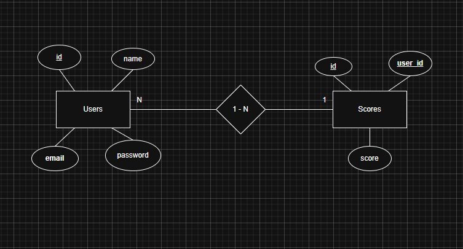

# ER Schema

Users contendrá un id, el nombre del usuario, su email y la contraseña de acceso al usuario, esta unido a Scores mediante una relacion 1 - N donde Scores contendrá un id, el id del usuario al que pertenece esa pu tuación y finalmente la puntuación