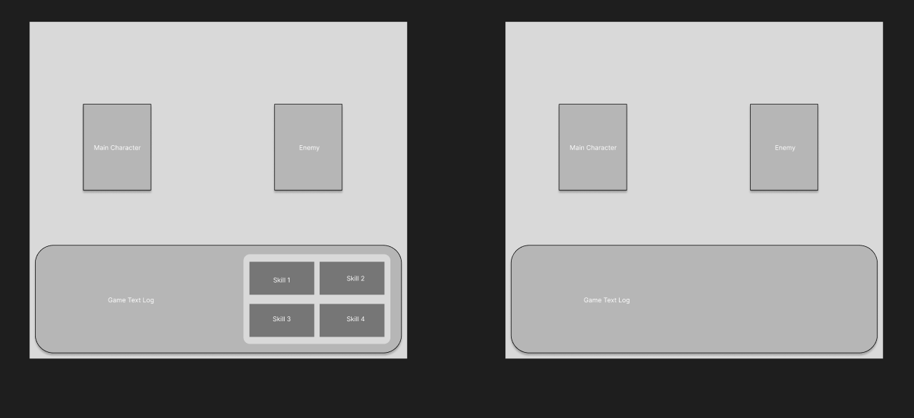

# Wireframe

https://www.figma.com/design/UXqLXKuCtduKAYFoNI7Qi4/HalamanWireframe?t=hiM3m4aCKDuVJ9Ny-1

# Mockup

En el turno del jugador, se elegirá una de las habilidades del personaje, este realizará la acción y llegará el turno del enemigo, tras este realizar la acción, volverá el turno del jugador

https://www.figma.com/design/LOZzyvmlrTRJx6TDdA4kVb/HalamanTowerMockup?node-id=0-1&t=rTCnqs4CmINnboH7-1

## Prototipe link

https://www.figma.com/proto/LOZzyvmlrTRJx6TDdA4kVb/HalamanTowerMockup?node-id=0-1&t=rTCnqs4CmINnboH7-1